# ICAPS Online Summer School Lab: Plan Execution in the Robot Operating System

This ROSject was created by [Gerard Canal](https://gerardcanal.github.io/), [Michael Cashmore](http://personal.strath.ac.uk/michael.cashmore/) and [Stefan Bezrucav](https://www.igmr.rwth-aachen.de/index.php/en/team-en/bezrucav-en).

## Preliminaries 

We will use [The Construct](https://www.theconstructsim.com/) as the simulation environment. This eases the task of setting up ROS, ROSPlan and eases the way to running the simulations.


To start with, you will need to create an account [here](rds.theconstructsim.com). Once you have your account, log in the [ROS Development Studio](rds.theconstructsim.com), and you will have your workspace.

The next step is to fork the base simulator. Note that each fork is an own copy, so it's like you were working on your computer. While simulations are public, the files will only be modifiable by you, so be sure to use an appropriate way of sharing code with your group (more on that later).


Now, navigate to the Base Summer School simulation: [ROSject: Task Planning for Robotics (ICAPS Summer School 2020)](https://rds.theconstructsim.com/r/gerardcanal/task_planning_for_robotics_icaps_summer_school_2020_ac52/) and fork it by pressing the fork button and then pressing "yes" so it clones the project:

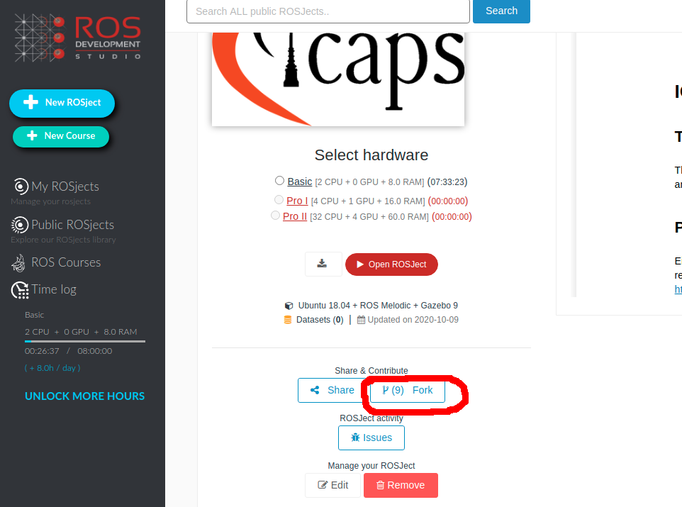


This will bring you to a similar page, but for your forked simulation. Now, start the simulation by pressing "Open Rosject". Make sure you do that in your fork:

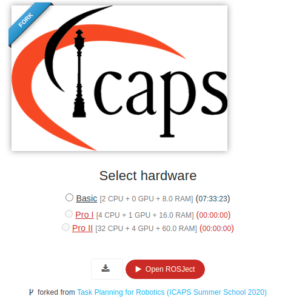


After loading (this may take a while), you should see this screen:

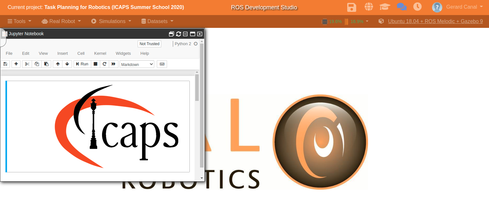

Now, we're ready to go!

## Exercise 1 - Preparation of the workspace

We have prepared a base source code for you to develop. The simulation includes all the needed code already, but the exercises will need you to fork our repository and install it in the construct.

Either individually or with your working group, fork the Training Lab repository with the exercises by going to https://github.com/gerardcanal/ICAPS_20_SummerSchool_ROSPlan

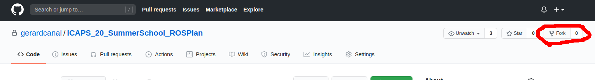

Clone the repository by opening a terminal (shell) in the construct (under the tools setting Tools):

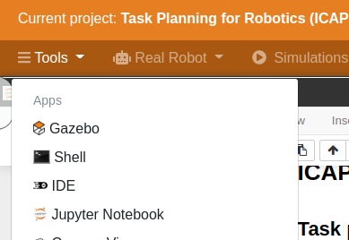


**<span style="color:red;">IMPORTANT NOTE</span> You need to run the following code every time you open a new terminal for everything to run smoothly:**

```
source /home/user/catkin_ws/devel/setup.bash
```


Then clone **your fork of repository** by running *(please, pay attention to this as the destination folder of the files is important)*:

```markdown
cd /home/user/catkin_ws/src/
git clone https://github.com/<YOUR-USERNAME>/ICAPS_20_SummerSchool_ROSPlan.git
```

Note that each of you will work on an independent instance on The Construct, therefore you should share your code through the git repository. Essentially, each instance of the construct is like your own computer. Remember to commit your changes often or save the session in the construct (by clicking on the save button at the top of the window). **Otherwise, your progress may be lost!**

You can save your progress in the construct by clicking the save icon:


### Building the base code

You can build the workspace by running:

```
cd ~/user/catkin_ws
catkin build
```

**Notice that building takes time in The Construct**, therefore you should try to make sure your code works.

Remember to build your code after making changes to source files (basically to cpp files. Changes to PDDL files do not need to be compiled).


## Scenario description

We will use a robotics scenario to illustrate the use of Planning in real-world domains. The scenario looks as follows:

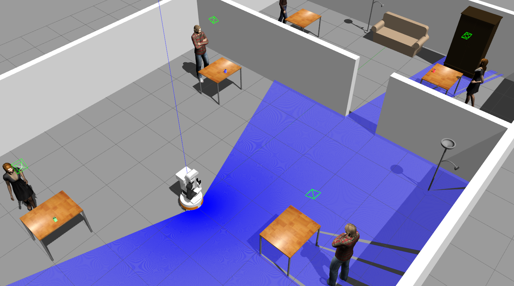

As you can see, there is a robot (Tiago) in a building with different tables, and three blocks (green, blue, and red). The robot has to perform an inspection task, visiting a set of locations in the office (different desks), and move the blocks from their current places to some defined goal locations.


Ideally, the robot should do this in an efficient manner, therefore taking as few time as possible. This will be achieved by trying to minimize the number of navigation actions, and not visiting each place more than once if possible.


## Exercise 3 -  Running the simulation

Let's now run the simulation to open the virtual world. In the construct, press in Simulations:

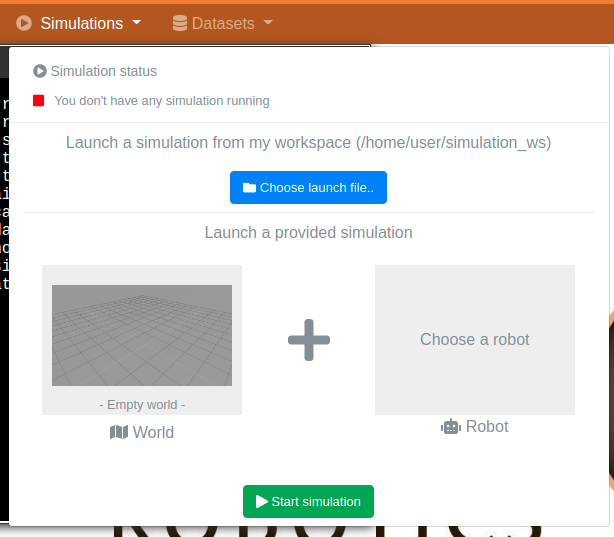

And then, press in "choose a launch file". You will get a drop-down menu, where you will need to find the "tiago_navigation_icaps20.launch". **Hint: it's at the end, so scroll to the bottom and you will find it under the section tiago_navigation_icaps20**. Make sure you select the navigation one and not any of the other two. Now, press LAUNCH:

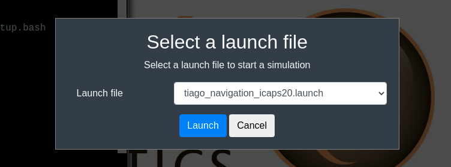

The simulator (Gazebo) will start to load:

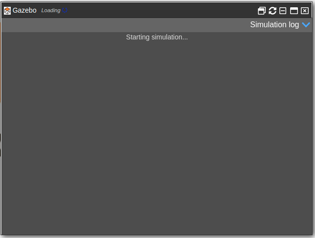

Notice the Loading on the top left, and wait until a green tick appears. If the green tick appears and the simulation is still not there, press the refresh button. An example can be seen here:

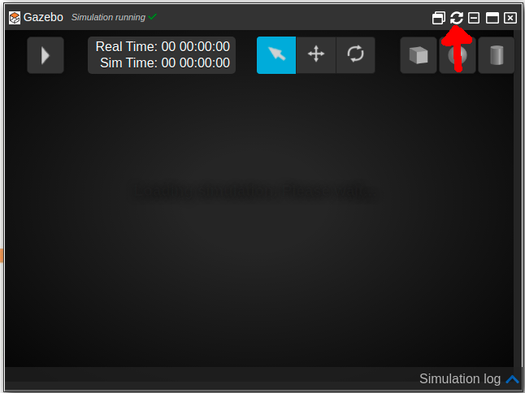

It often happens that after pressing refresh it still does not load. If this is the case, go back to [The beginning of the exercise 3](#Exercise-3--- Running-the-simulation), press in "Change the simulation":

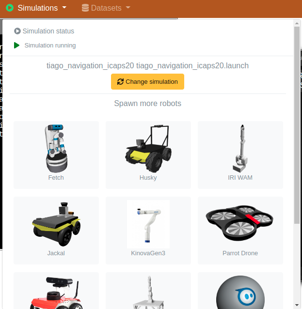


And relaunch it again as we did before. Hopefully, we will have a robot environment this time:


You can move the camera in the simulator with your mouse. With right click (holding it) you can translate the camera, with a middle click (holding) you can rotate it. Before executing anything and after launching the simulation, wait for tiago to tuck his arm and be in this position:

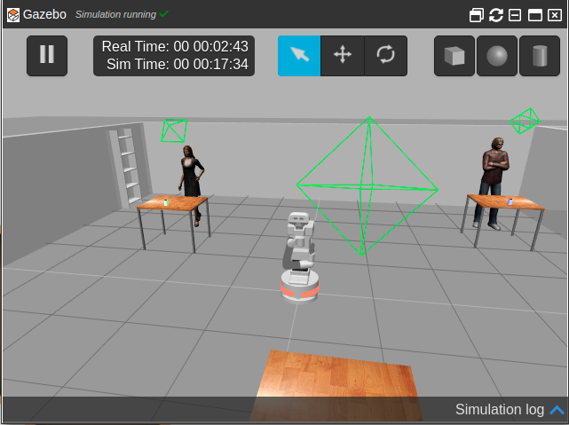


If for some reason Tiago has two arms, refresh the simulation using the refresh button from before.


## Exercise 4 - Running more than the simulation

Now that we have the simulator running, let's see what do we need to run in order to test the planning system. 

Open a new Shell terminal, and source the environment:

```
source /home/user/catkin_ws/devel/setup.bash
```

Then, run the following line:

```
roslaunch icaps_ss icaps_ss_full_system.launch
```

This will launch all the needed ROS nodes for our system to work. More specifically, this starts all ROSPlan nodes needed for planning, and the interfaces for moving the robot.

A ROS node is an executable inside the ROS ecosystem, which is connected to other nodes by means of topics (which are pipes between nodes), services (blocking function calls from one node to another) and actions (non-blocking function calls).

Wait until everything has correctly launched, and you see something like the following in the terminal:

```
[ INFO] [1602255285.929269681, 1100.282000000]: KCL: (place) Ready to receive
[ INFO] [1602255286.032010338, 1100.294000000]: KCL: (grasp) Ready to receive
```


Now, you will learn how to run the planning system for the rest of the exercises, and see the robot moving.

Open a new shell terminal, and remember to source the setup.bash:

```
source /home/user/catkin_ws/devel/setup.bash
```

Now, to run the planning system and have the robot moving, run:

```
rosrun icaps_ss main_executor.sh
```

This will run the bash script called `main_executor.sh` which is inside the ROS package called icaps_ss. 

The script performs call to the necessary ROSPlan services to perform:

- Problem generation
- Planning
- Plan parsing
- Plan dispatcher (execution)

You can take a look at it by opening the IDE under the Tools menu in the construct, and navigating to `catkin_ws/src/ICAPS_2020_SummerSchool_ROSPlan/icaps_ss/src`:

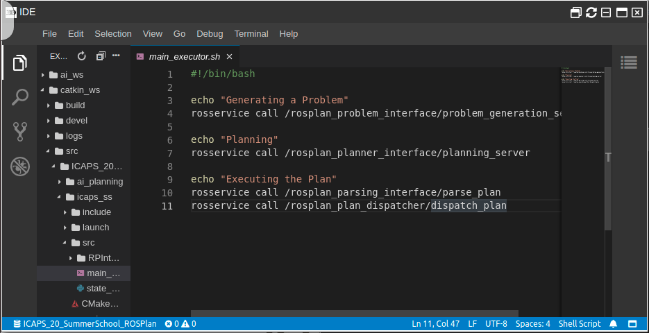

Notice that every time that the planning execution fails (which happens often in the real world), you will need to re-run the script to plan from the current state onwards. Don't worry about errors that terminal when planning fails.

You can use the IDE to modify the code and files inside the construct.

Once you have seen the robot moving around, try to see what is it doing, but you don't need to wait until the end. We'll go through that in the following exercises. You can stop the processes by pressing `Ctrl+C` in each terminal.


## Planning exercises

### Exercise 1 - Do we really need planning for this?

One way to solve the problem would be using a [State Machine](https://en.wikipedia.org/wiki/Finite-state_machine) (SM). Therefore, let's develop one to solve the problem.


First, design a State Machine to solve the "visit all" problem (visiting a set of waypoints in the map). Feel free to implement it in Python, so we can add calls to the robot movements later (this is optional).


Once you have designed your visit-all SM, add there the ability of moving the cubes to the designated locations.


That should have been doable. Now, let's say we want it to be more efficient, so it minimizes the traveled distance or the time that the robot needs to perform the task. How would you do that?


### Exercise 2 - Now let's try with Planning

The [Robot Operating System](https://www.ros.org/) (ROS) is a set of tools to programming robots. In order to perform task planning for robots, the [ROSPlan](http://kcl-planning.github.io/ROSPlan/) system simplified a lot the task, as it's built on ROS and has many planners available, as well as action dispatchers. Feel free to check the webpage and the tutorials, although **you do not need to do them in order to complete these exercises**.


We have made a visit-all domain that you can find in the ai_planning package, which is inside the repository you downloaded.

The domains are in `ai_planning/common/`. You should use the `domain_start.pddl` and the `problem_start.pddl`. Proposed solutions are already there, but we strongly encourage you to **not cheat** and try to solve the problems first.

Run the domain and see what the robot does. The robot should visit 6 waypoints (places where the robot needs to go, plus the initial position of the robot). Following, a depiction of where is each waypoint located:

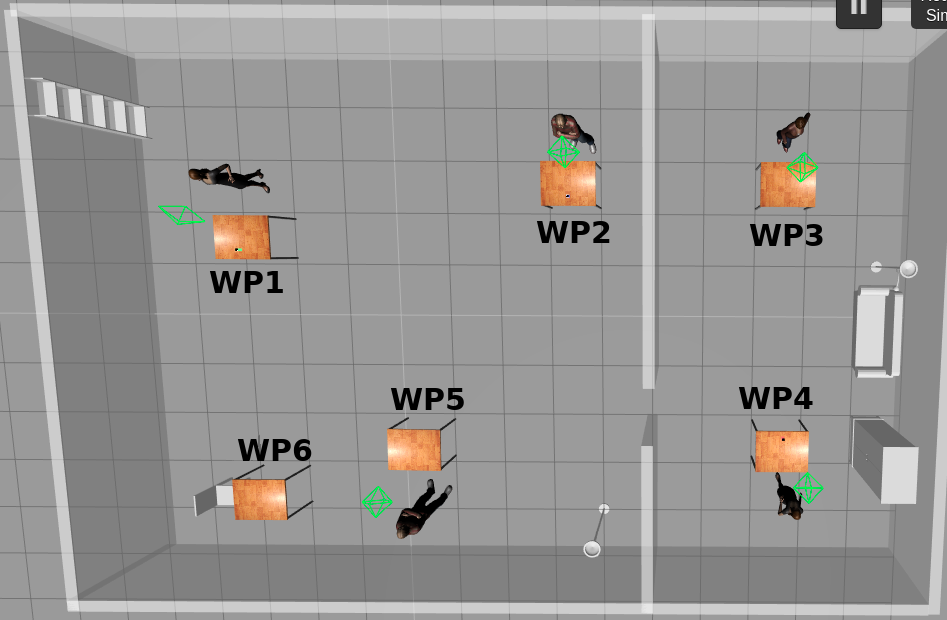

Is the robot visiting all the 6 waypoints? If not, can you fix the *problem file* so it visits all of them? 


##### Planning for moving objects

Similar to what we did with the SM, let's add the option to move the objects. If you check the domain file `domain_start.pddl`, you will see that there are two actions, the `grasp` and the `place` to grasp and place an object on the surface, respectively. 

- Now, modify the `problem file` so that the planner also grasps and places the objects. More specifically, we want to end the task with:
  - The red box in the wp2
  
  - The blue box in the wp1
  
  - The green box in the wp3
  
    You may also have to specify the initial state, so check where are the objects located!

- Let's execute now the problem and see what happens. Is the planner able to find a plan? If not, can you find why and fix the issue? *Hint: check the domain file, and make sure the actions are correctly defined and make sense*


### Exercise 3 - Adding costs

At this point, you should be able to find and execute a plan where the robot (tries to) move the cubes around and visit all the set of waypoints. Now, let's make it more efficient by adding some distance costs.


First, let's compute the distance between all the set of waypoints. As a help, you can use the following Python2 script:

```python
import rospy
import math

wps = rospy.get_param("/waypoints")

N = len(wps)

def euclidean(a, b):
	return math.sqrt((a['x']-b['x'])**2 + (a['y']-b['y'])**2 + (a['z']-b['z'])**2)

wps['init'] = {'position': {'x': 0, 'y': 0, 'z': 0}}
wp_names = ['init'] + ['wp' + str(i) for i in range(1, N+1)]
for a in wp_names:
	for b in wp_names:
		d = euclidean(wps[a]['position'], wps[b]['position'])
		print "    (= (distance " + a + " " + b + ") " + str(d) + ")"
```

The script obtains the coordinates of the waypoints which are stored in the ROS Parameter Server (and loaded by the launch scripts). It then prints the distances as PDDL predicates that you can add to your domain.


Modify anything you need so that the planner uses this distance functions to minimize the traveled distance. 


### Exercise 4 - The real world is more complicated

After completing exercise 4, the robot should minimize the number of waypoints visited, so that the total time is lower. This should be a big advance to the SM approach, and should have been way easier to implement. 

However, following this approach, you should see something strange. The robot some times leaves the green cube in the wpXX, and then goes through the door to get the blue cube instead of getting the red one which is closer.

Can you see why this would happen? How can you fix it? 


As you can see, modeling the real world is not always as easy as one may imagine at the beginning.


### Exercise 5 - Acting and replanning

You will probably have got to replan many times so far, when for instance the grasping system fails. Now, let's force some replans and see how can we improve the way the actions work. 


- ROSPlan uses Action Interfaces to link the abstract PDDL actions with the low-level robot constraints. The grasping action interface assumes that there will be an object there. Now, let's see what happens when no object is there, by removing it from the simulator before the robot goes there. This can be done by **XXXXX**. Once the robot arrives, it will stay forever there. Now, let's modify the action interface so the action fails after a timeout. 

  **COMPLETE THIS**

- Although we simplified it in this lab, in a real robotics scenario the Knowledge Base that keeps an updated state will be kept up-to-date by using information from the robot sensors (for further info you can check the ROSPlan's Sensing Interface). Thus, a change in the environment will update the knowledge base, which may make the plan fail, for which then the robot will have to replan. This has a nice side effect, which is that the robot may be able to solve problems even when the model is not correct (i.e. unexpected side effects of an action that makes it fail). The robot will see that the next action can't be executed, and will replan accordingly. 
  Now, let's simulate one of such events. While the robot is performing the task, execute:

  ```
  rostopic pub XXXXXXXXXXXXX
  ```

  After executing this, the robot will **<explain what can't perform>**. Thus, the plan will fail, and a replan will be needed. **i'm thinking in moving the object from on table to another or something like this, or changing the place location while the robot is moving a block**

  **Add also goals and something else**
  
  


